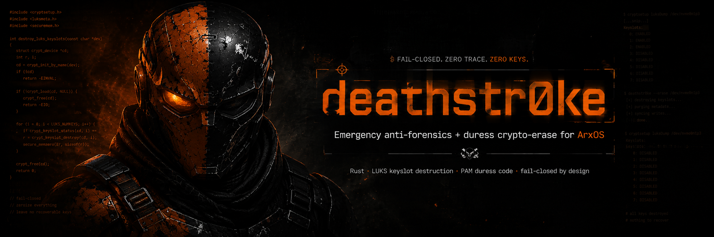

<div align="center">



# deathstr0ke

**Recovery-preserving duress keyslot destruction for encrypted Linux systems.**

Rust · LUKS keyslot destruction · PAM duress code · TPM measured-boot seal · fail-closed

<sub>Every destructive path stays inert until you run <code>dsctl arm</code>; <code>dsctl disarm</code> re-engages the guard.</sub>

</div>

## Overview

deathstr0ke is a last-resort protection layer for an encrypted Linux machine. Its
normal trigger destroys the verified **daily unlock keyslot** while preserving a
separately enrolled and verified offline recovery slot. That blocks the daily
credential without pretending the ciphertext is unrecoverable to its owner.

An operator-only full-erasure mode exists, but it is deliberately not the product
default: it requires the explicit pair `--mode erase --destroy-recovery` and destroys
every LUKS keyslot, including recovery. Do not use that mode unless permanent loss is
the intended result.

The implemented paths cover the pre-boot unlock manager and the supported Arch Linux
`system-auth` PAM layout used by the graphical/login authentication stack. A duress
phrase never opens a session. Consecutive failures are recorded durably and can trigger
the same daily-slot destruction policy. The actor then attempts to quiesce networking,
terminate the active seat, close the configured mapping, and force poweroff.

The crypto path runs on stock `cryptsetup` (`luksKillSlot`, with explicit opt-in
`luksErase`), so there is
no patched crypto to carry across upstream releases. The whole toolkit, including the
PAM module, is written in Rust.

## TPM measured-boot seal

The hard case is an offline adversary who never enters a prompt, so deathstr0ke can enroll
a LUKS keyslot to the **TPM, bound to the boot-chain PCRs**. The disk then unlocks only
on an expected measured boot chain. The effectiveness of this control depends on the
platform's firmware, Secure Boot state, chosen PCR policy, and recovery-factor policy;
an editable ESP is not made trustworthy merely by storing a counter there. A **PIN** is
required by default, so mere possession of the
powered-off machine does not unlock it, and a non-TPM factor (passphrase, optional FIDO2)
is always kept so a TPM clear or mainboard swap never bricks the owner. `dsctl tpm-check`
audits readiness (TPM device, `systemd-cryptenroll`, Secure Boot / PCR-7 state) without
changing anything.

`dsctl tpm-check` reports the local TPM, cryptenroll, EFI, and enrolled-token state. It
does not certify the firmware or measured-boot chain.

## Limits

deathstr0ke does not defeat physics and does not pretend to.

- A versioned journal at `/boot/efi/deathstroke/inprogress` records the target, daily
  slot, recovery slot, mapping, scan roots, and completed phases. The initramfs refuses ordinary unlock
  while a matching journal needs recovery, and `ds-erase --resume` validates the journal
  against the expected boot target and both slots. This implementation is pending
  actual reboot validation; editable ESP metadata is not a trusted authority by itself.
- It can only discover header backups under explicitly configured scan roots. Unknown,
  offline, cloud, snapshot, and removable-media copies remain outside its control.
- Unlinking or overwriting a file is not a guarantee of physical cell erasure on SSDs,
  flash media, copy-on-write filesystems, or storage with remapping.
- RAM captured before a trigger is outside its reach. Memory-zeroing and hibernation
  controls reduce exposure but do not create a universal guarantee.
- TPM protection is platform- and policy-dependent. A non-TPM offline recovery factor
  intentionally remains capable of opening the preserved recovery slot.

## Components

| Component | Role |
|-----------|------|
| `ds-core` | Duress-code hashing (PBKDF2-HMAC-SHA256), constant-time verification, secret zeroing |
| `ds-erase` | Journaled LUKS action: destroy the recorded daily slot by default; full erase only with explicit recovery-destruction acknowledgement |
| `dsctl` | Setup and control: set the duress code, enroll a recovery key, seal to the TPM, arm, disarm, status |
| `pam_ds` | PAM module for the validated Arch `system-auth` layout, with duress matching and a consecutive-failure limit |
| `ds-unlock` | Pre-boot LUKS unlock manager (initramfs hook): duress phrase, attempt limit, and unlock before root mounts |

## Usage

Set it up and arm it with `dsctl`:

```sh
sudo dsctl set-duress          # set the duress phrase (hashed with PBKDF2, never stored in clear)
sudo dsctl enroll-recovery --device /dev/DEVICE \
  --existing-keyfile /secure/daily.key --new-keyfile /offline/recovery.key
                                  # proves and records distinct daily + recovery slots
sudo dsctl tpm-check           # audit TPM / Secure Boot readiness (read-only)
sudo dsctl seal-tpm            # seal a keyslot to the TPM + boot PCRs, protected by a PIN
sudo dsctl arm                 # drop the guard: duress + attempt-limit go live
sudo dsctl status              # what is armed, which slots, TPM state
sudo dsctl disarm              # re-engage the guard (non-destructive)
```

`arm` is transactional: it validates both slots, the verifier, bounded policy, supported
PAM layout, ESP state, mkinitcpio hook order, and initramfs rebuild before committing the
PAM integration. `disarm` restores the exact PAM backup and rebuilds the initramfs.

Installer policy options are `set-duress --lockout-at N --wipe-at N`, optionally
`--max-prompts N --lockout-delay N`. Invalid, duplicate, missing, or unknown options
fail before enrollment. The policy is stored with local state and copied to the ESP
by `arm`. These latest changes still require the throwaway VM test gate.

## The arm guard

During development, destructive-adjacent operations additionally require
`/etc/arxos/deathstroke/DISPOSABLE_MACHINE_OK_TO_DESTROY`. `ds-erase --self-test`
uses a temporary loopback volume. Product triggers select the recorded `daily.slot`;
full erasure is never inferred from a PAM, pre-boot, or dead-man trigger.

## Build & install

```sh
cargo build --release
cargo test --workspace --all-targets
sudo ./install.sh        # binaries + PAM module + the pre-boot mkinitcpio hook (inert until armed)
```

`install.sh` places the `ds-*` binaries and `pam_ds.so`, and installs the `mkinitcpio`
hook (`mkinitcpio/{install,hooks}/deathstroke`) that runs `ds-unlock` before the root
filesystem is mounted. On ArxOS the installer is also offered as an opt-in during setup;
everything stays inert until `dsctl arm`.

## Verification status

2026-09-09 checkpoint: the previous throwaway run observed 13 unit tests, a
debug build, and 9 unlock self-checks passing. A later regression sequence was
interrupted; its final result is unknown and its temporary logs did not survive
shutdown. These observations do not establish installed-system safety or release
readiness. No destructive tests were resumed in this continuation.

Run all tests inside the designated disposable throwaway VM. Do not run this test
suite on the development host. The latest recovery-slot validation, disarm rollback,
and installer policy changes supersede earlier passing results.

The source-level hardening and safe loopback/PAM tests are implemented. Release remains
blocked until the rebuilt ArxOS ISO passes a fresh encrypted Calamares install with a new
non-default user, pre-boot normal/duress/attempt-limit checks, forced interruption and
journal resume, recovery-slot boot/recovery, PAM login/lock/sudo coverage, clean disarm,
and first-boot evidence. See the ArxOS coordination Markdown for the current release gate;
do not describe the feature as fully verified before that evidence is recorded.

---

<div align="center">
<sub>An <a href="https://arxos.uk">ArxOS</a> project, by <a href="https://stingraylabs.pages.dev">Stingray Labs</a>.</sub>
</div>
